# 影像报告书写训练 · 验收图册（2026-09-20）

> 本图册为**逐屏实拍**（Playwright 抓取，非设计稿）。对应实现 commit 见 `项目日志.md` 同日条目。
> 训练端 `http://localhost:5001` · 管理端 `http://localhost:5002`

## 一、训练端 · 学员

### 1. 训练列表页（兼模块首页）

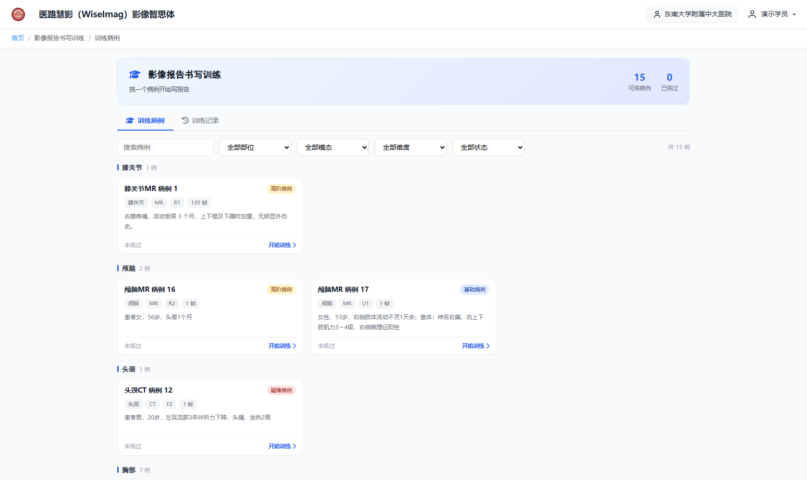

- 筛选栏：**搜索在最前**，其后四个统一下拉（部位/模态/难度/状态），选项只列题库里真实存在的值
- 卡片：**学员侧标题**为`部位+模态 病例 N`（不含征象与诊断）；信息行为 chip（部位·模态·难度·帧数）；**不放预览图标**

### 2. 训练记录页签

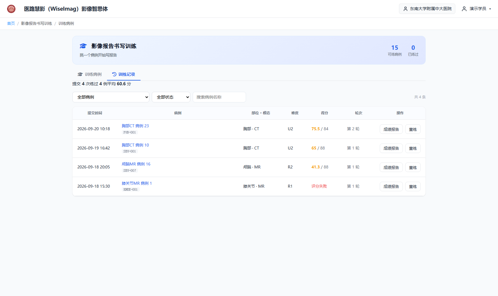

4 条演示记录，覆盖 **高分 / 中等 / 低分 / 评分失败**；前三条例由**真实评分引擎**生成（`resolveRubric → composeScore`），数字自洽。

### 3. 成绩报告（总览条 + 得分明细）

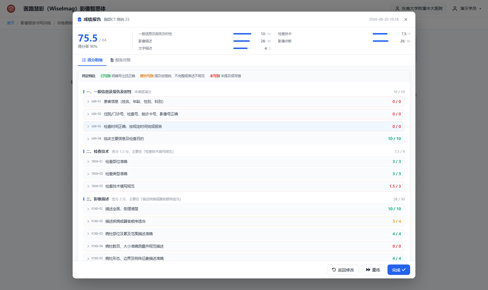

- 总览条**一直可见**：总分 / 本卷可评满分 · 得分率 · **达标/未达标（含难度线与阈值）** · 缺失条数徽章（可点跳明细）· 维度得分 2 列网格（两列对齐）
- 得分明细：先给**档位判据图例**，再逐维度（含一句话点评）→ 逐条目 → 逐要点（**中文档位标签** + 要点分值 + 点评；不评的要点写明原因）

### 4. 成绩报告 · 报告对照页签（**训练侧专属**）

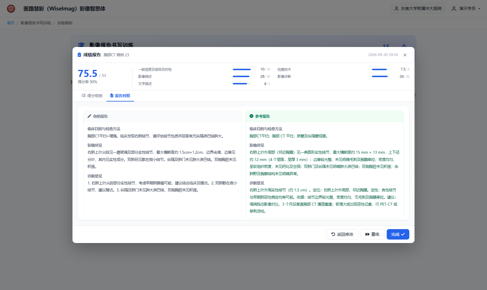

学员三段 vs 参考报告逐段并排；段二参考 = 题面检查目的 + 金标准检查方法。

### 5. 训练工作台

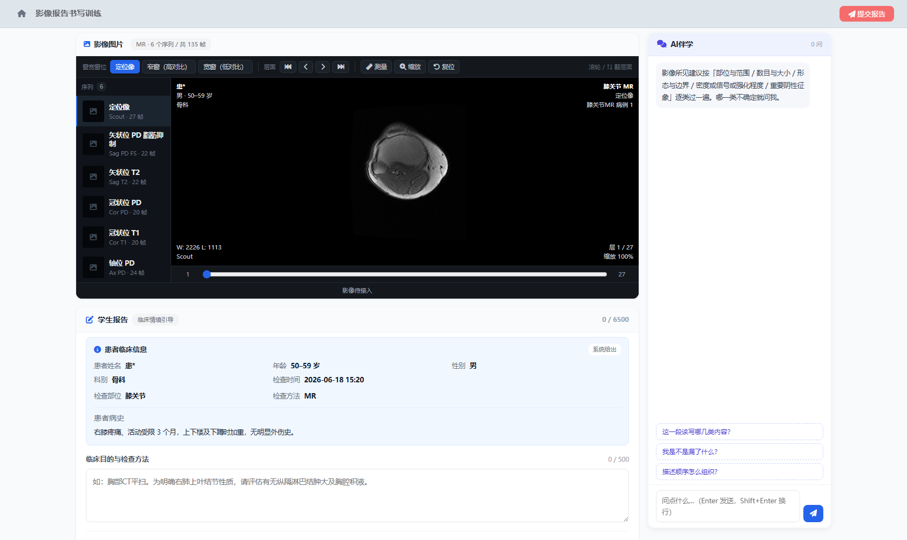

- **站点页**框架：无布局层顶栏/面包屑
- 影像卡片 = **PACS 式阅片器**：工具条（窗宽窗位预设 · 层面 · 测量 · 缩放 · 复位）+ 左侧序列栏 + 四角叠加信息 + 底部层面滑动条
- **四段式报告**：段一「患者临床信息」为**系统给出的只读情境**（患者信息 + 病史，**不含检查目的**），学员写后三段，合计上限 6500
- 右侧 **AI伴学**（粘性）：训练侧才有

### 6. 阅片器 · 真测量

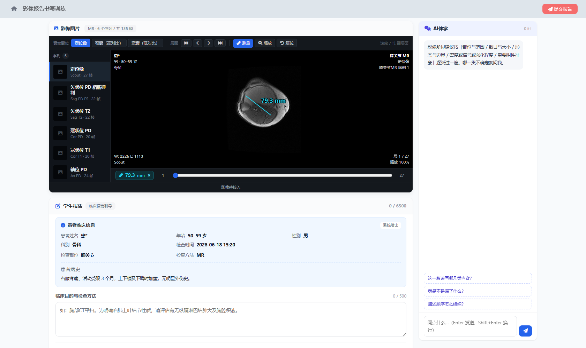

KNEE-001 是 **16-bit 原始像素**序列（带 `PixelSpacing`）：按住拖动画线，按像素间距换算**毫米值**，结果同时显示在图上与底部结果条。

### 7. 阅片器 · 缩放与真窗宽窗位

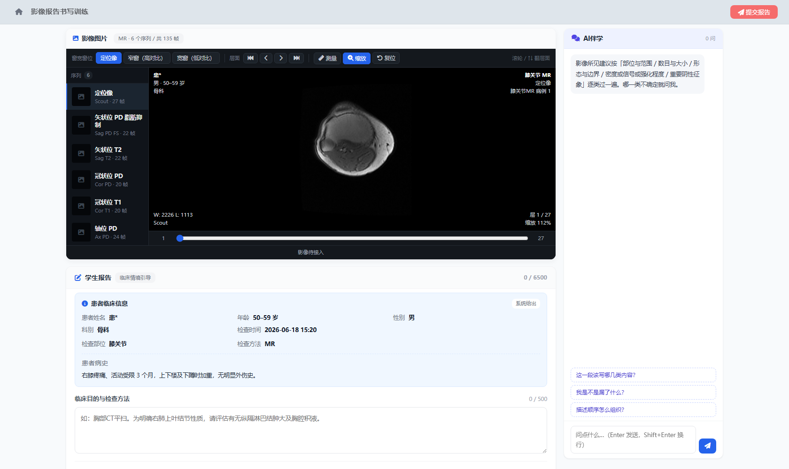

- 缩放：滚轮以**画面中心**为锚点，25%–800%；拖动平移；**四角信息与工具栏不跟着缩**
- 真窗宽窗位：对原始像素**逐像素重算**（不是换标注）—— 这一条只有带 `raw` 的序列支持

## 二、训练端 · 练习考（考核侧 A 路）

### 8. 须知页

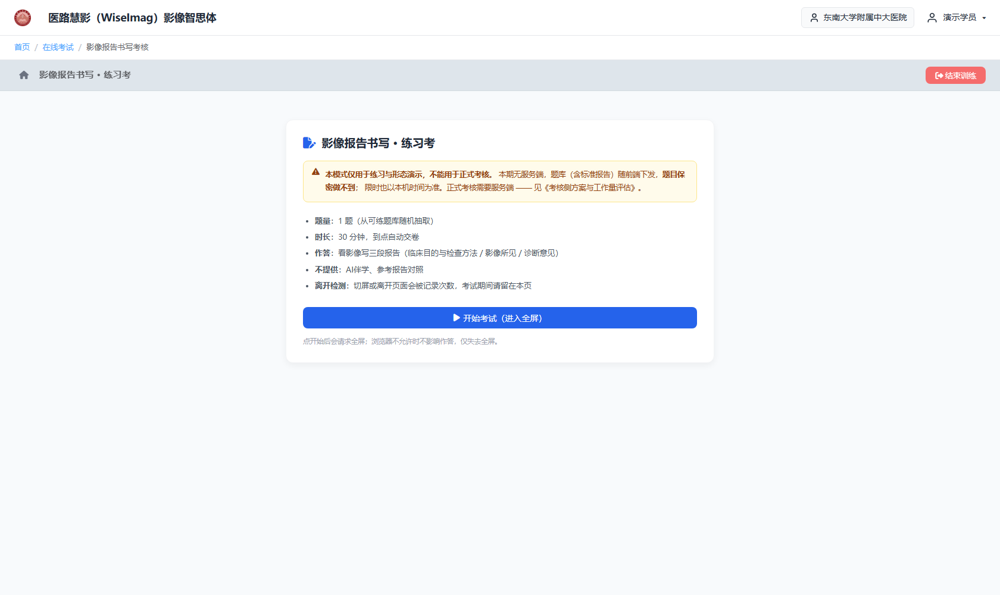

醒目提示：**本模式仅用于练习与形态演示，不能用于正式考核**（题目保密做不到、限时以本机时间为准）。

### 9. 考试中

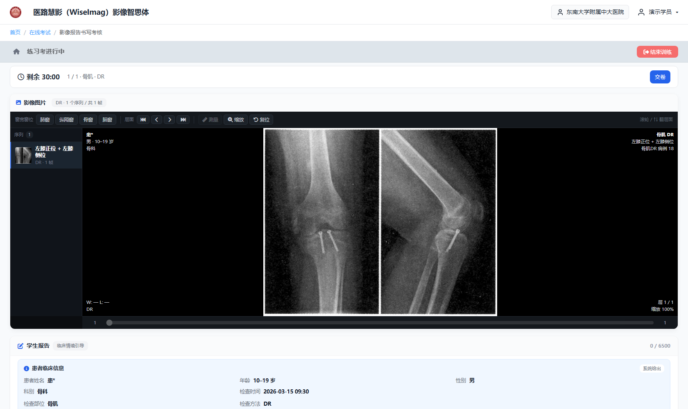

- 顶部粘性状态条：剩余 mm:ss（≤5 分钟转红）· 题号/部位/模态 · **离开记录次数** · 交卷
- 有阅片器与三段报告，**没有 AI伴学**
- 限时 `deadline` 落本地，**刷新不重置时钟**；切屏/失焦计数

### 10. 已交卷

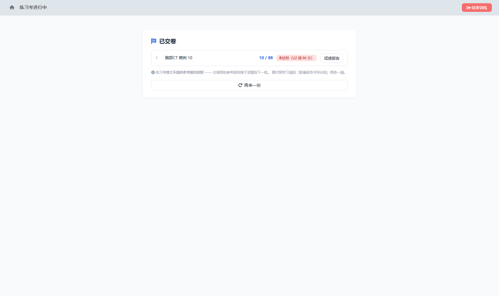

逐题分数 + 达标情况（含难度线与阈值）+「成绩报告」入口。
> 本张抽到的是 SEU-001（肺隔离症），而截图脚本写的是通用肺结节报告 →
> 内容不匹配故仅 10/88。**这正好说明评分判的是内容、不是格式。**

### 11. 练习考的成绩报告（**没有「报告对照」**）

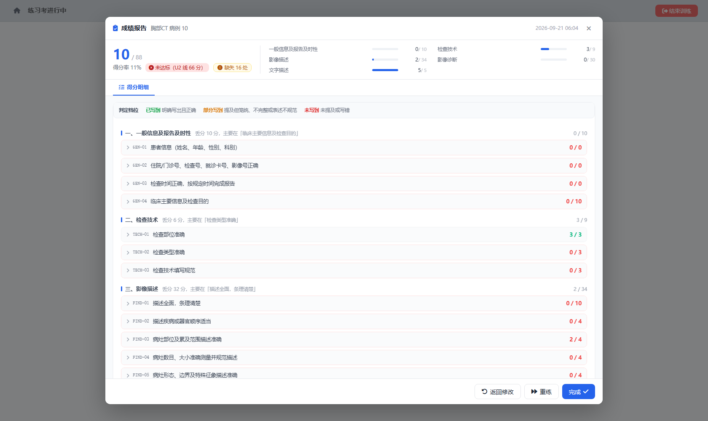

页签只有 `["得分明细"]`，**含「对照」= false** —— 交卷后给参考报告等于**泄题给下一批**（考核侧方案 §3.5 第三道口子，由 `ScoreReportModal` 的 `hideCompare` 落实）。

## 三、管理端 · 题库与模板

### 12. 影像报告题库列表

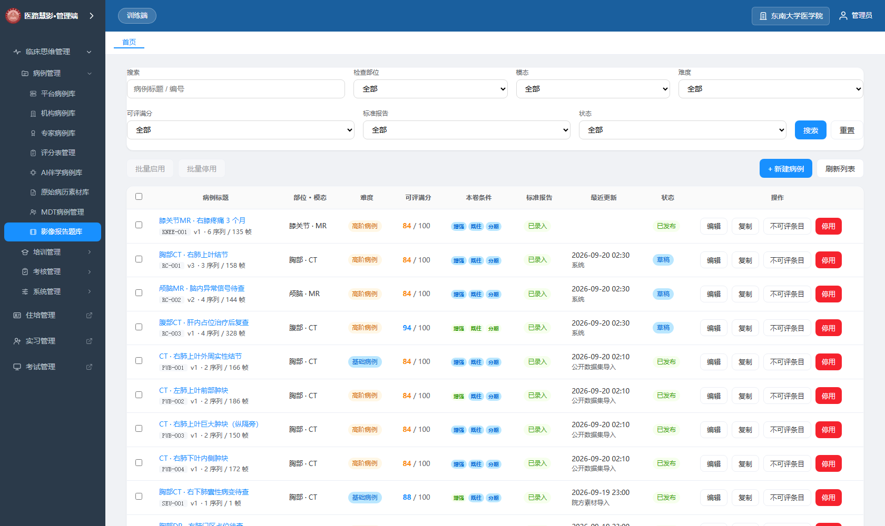

对齐「病例库」：筛选两行、`状态` 与 `操作` **双右固定列**、空态在表内；列为 病例标题 / 部位·模态 / 难度 / 可评满分 / **本卷条件** / 标准报告 / 最近更新 / 状态 / 操作。

### 13. 影像题库编辑器 · 影像与报告

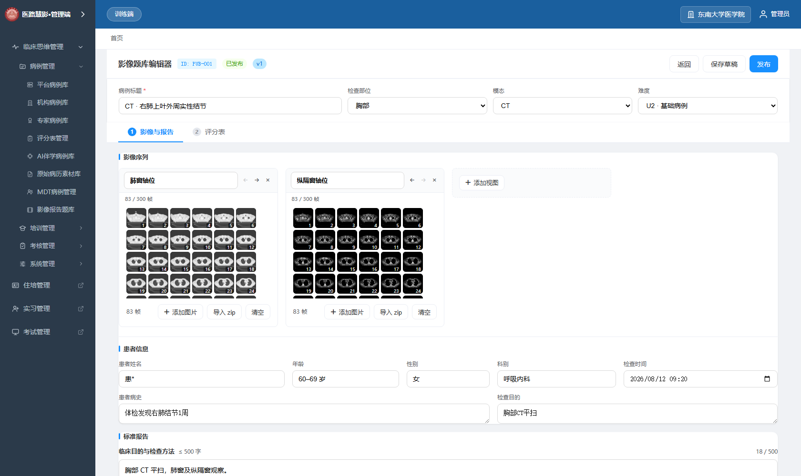

钉顶头部（ID/状态/版本徽章）+ 钉顶基本信息（标题/部位/模态/难度**一行四列**）+ 两个页签。
本页：影像序列 → 患者信息（5 字段 + 病史/检查目的两栏）→ 标准报告。

### 14. 影像题库编辑器 · 评分表

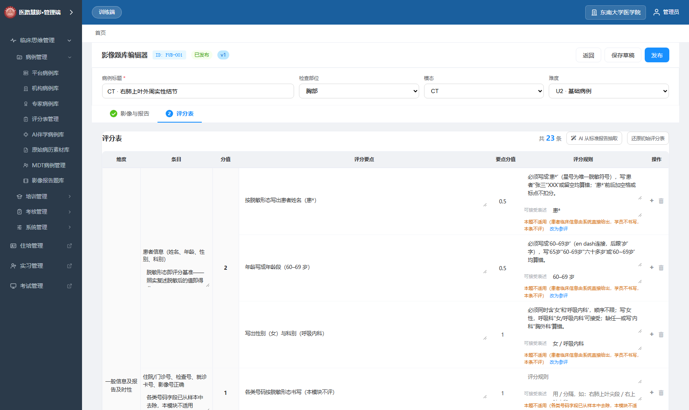

7 列：`维度 | 条目（含整条判定说明） | 分值 | 评分要点 | 要点分值 | 评分规则（含可接受表述） | 操作`
**全部 23 个条目、所有字段都可编辑**，每行都有 `+ / 删除` 按钮。

### 15. 评分表管理（影像报告模板已并进列表）

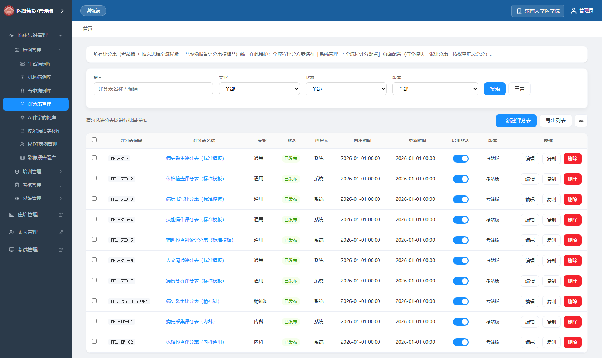

影像报告模板**作为该页列表里的一行**（`IMAGING`），与考站版/全流程版同表 —— 参与**搜索、专业筛选、条数统计、分页**。

### 16. 模板结构与难度分层标定

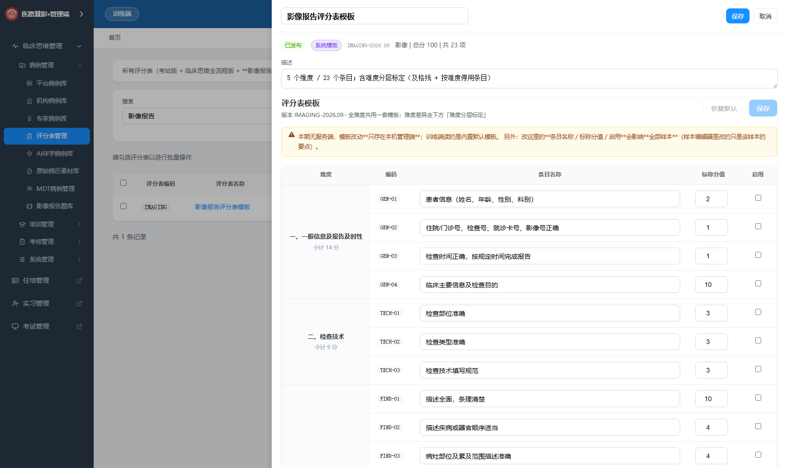

点开影像报告模板的详情：上半为**模板结构**（维度/编码/条目名称/标称分值/启用，含每维度小计与合计），
下半为**难度分层标定**（各难度及格线 % + 折算分数 + 停用条目多选）。
页内醒目提示：本期无服务端，改动**只在本机管理端生效**。